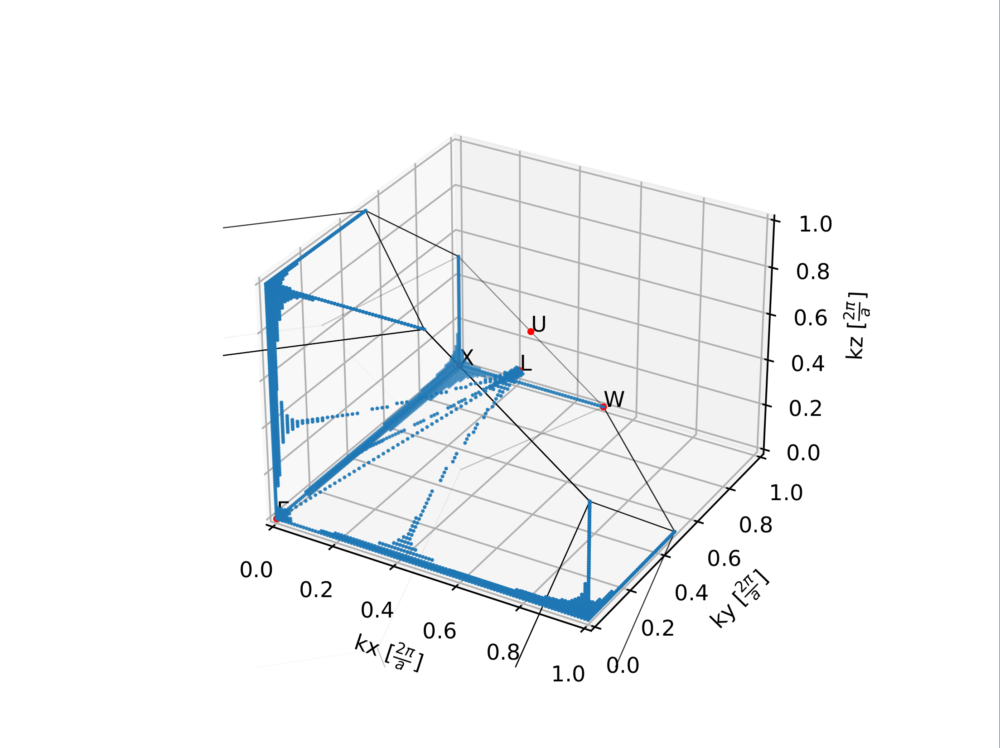

# Bachelor's Project
Simulation of topological nodal lines in silicon using Python and Quantum Espresso

# How it works

Create band structure with given k-points

```python
import os
import matplotlib.pyplot as plt
from settings import BANDS_GNUFILE
from energy import (create_file, calculate_energies,
                    init_scf_calculation, create_band_image)

# Must be in qefiles directory
os.chdir("qefiles")

# You must first do an SCF calculation
init_scf_calculation()

# Create the points
points = [[0.0, 0.0, 0.0],
          [0.25, 0.25, 0.25],
          [0.5, 0.5, 0.5]]

# Create a Quantum Espresso input file
create_file(points)

# Calculate the energies
calculate_energies()

# Create a band image
create_band_image(BANDS_GNUFILE, "figures/band.png")
```

Similarly to do calculations across a 3D section of a Brillouin zone do,

```python
import os
from settings import VALENCE_MAX 
from energy import (create_file, calculate_energies,
                    init_scf_calculation, create_band_image)

# Must be in qefiles directory
os.chdir("qefiles")

# You must first do an SCF calculation
init_scf_calculation()

# Do 3D grid calculation
Lrange = [0, 1]
create_quad_BZ_grid("grid_name", kx_num_points=150, ky_num_points=150,
                    kz_num_points=150, kx_range=Lrange, ky_range=Lrange, kz_range=Lrange)

# Plot the places in the 3D grid where bands overlap. Ie. find nodal lines
(_,ax) = plot_3d_intersects("grid_name", emin=-12, emax=VALENCE_MAX+0.1,
                              plotrange=plotrange, colors=False, epsilon=0.001,
                              include_conduction=False)

# Plot the 3D fcc Brillouin zone to the same plot
plot_fcc(ax)

# Show the plot
plt.show()
```

This produces the following output:

 
*Image of nodal lines in a quadrant of the fcc lattice. k-points are in units of 2pi/a*
